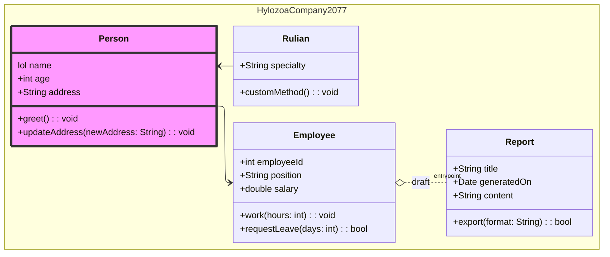

#### Synopsis
- [Mermaid](#what-is-mermaid)
- [Example](#example)

# Mermaid
#### Schemas configured as code

As the saying goes, an image is worth a thousand words...  
Whenever I tried to create schema before, I always had trouble keeping it up-to-date and had to drop it :(  
But no longer thanks to Mermaid ! 

### What is Mermaid ?

Mermaid is a language to create schmas.     
No long are you stuck editing PNGs !    

You can access the online tool [here](https://mermaid.ai/app/projects/6c38f33b-3b7d-40c4-ab9d-e647b98da993/diagrams/990549d1-222d-4321-b2b0-89609357d2f0/version/v0.1/edit?shouldShowPopup=true). 
And the project's GitHub [here](https://github.com/mermaid-js/mermaid/blob/develop/README.md).  

What's even better, `mmd` _(mermaid markdown)_ **is supported in GitHub Readme !**    
###### it's unfortunatly not supported by Docusaurus :(

### Example

   

And here is the associated code, that you can copy paste and easily edit!    

